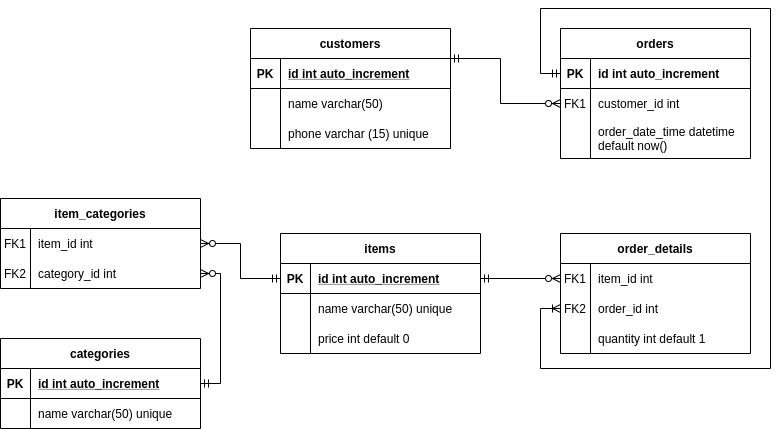

# Final Project
The final project of intermediate-class is creating a system to do :
1. **Menu management** for maintaining menu items (food or beverage) information such as
name, price and their categories.
2. **Customer management** for maintaining customer information such as name and phone.
3. **Order management** to record each customer transaction, the total amount they spend,
transaction date, and also the menu items they order.

## Project Structure
The structure of the project is explained in below. The tag `homework` means the file is the homeworks files.
```
|_ controllers
|_ db
| |_ db.sql  
| |_ db_test.sql         
| |_ mysql_connector.rb  
|_ models
|_ public
| |_ img
| |_ stylesheets
|_ docs
| |_ snapshots   
| |_ erd.png   
|_ views   
|_ main.rb            
|_ README.md
```

## Instructions
1. Install the needed gems.
```
gem install sinatra
gem install mysql2
gem install simplecov
```
2. Login to mysql using the username and password. Copy and paste `db.sql` contents to mysql.
3. Export the environment variables in terminal. Notes: DB_HOST can use `localhost` value for your personal environment.
```
export DB_HOST=<your_host>          
export DB_NAME=oms_db
export DB_USERNAME=<your_username>
export DB_PASSWORD=<your_password>
```
4. Run `ruby main.rb`. To see the web enter `localhost:4567` in your browser.
5. To test, export the DB_NAME to oms_db_test by using command below. Run `rspec -f d` to run all the specs 
```
export DB_NAME=oms_db_test
```

## ERD
Homepage\
