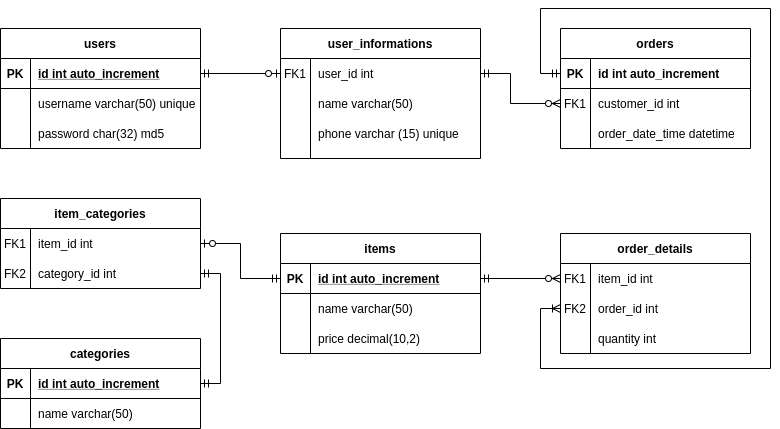
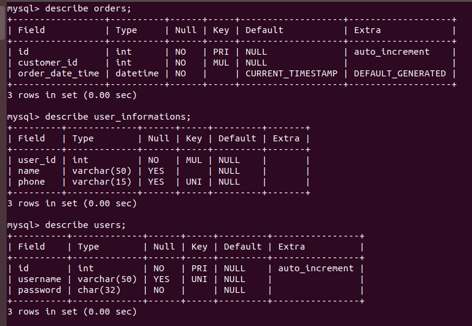
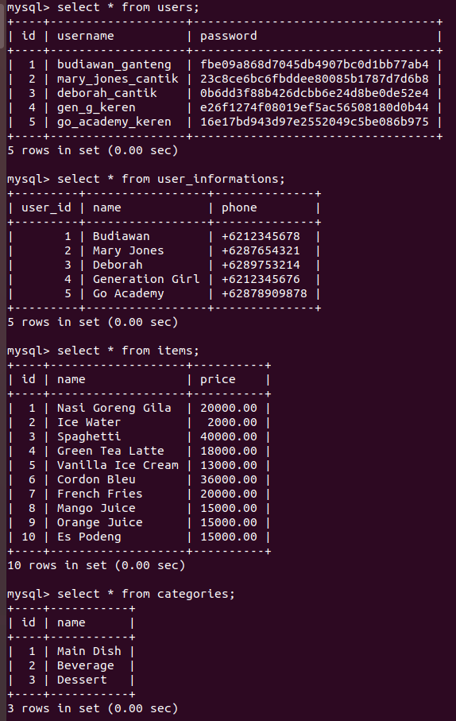

# Week-2 Homework
This folder is used for the homework in week-2. All the SQL(s) can be accessed in the homework.sql files.

# Entity Relationship Diagram

# DDL Result Snapshots

 

# DML Result Snapshots
## Insert

 

## Select
