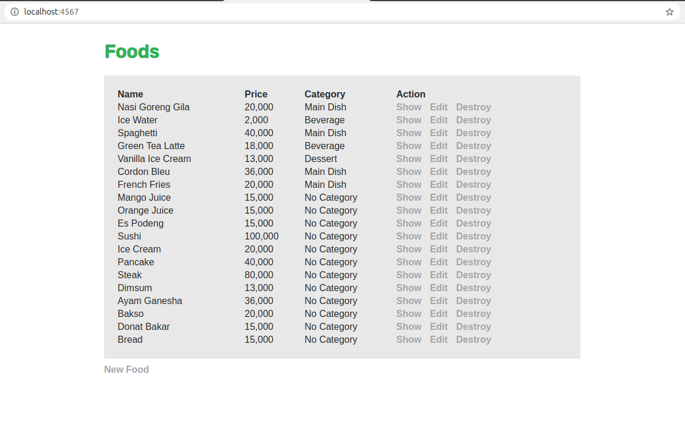
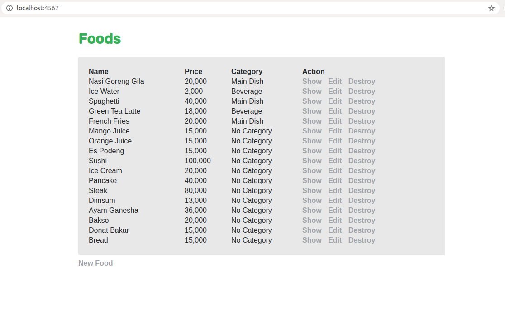
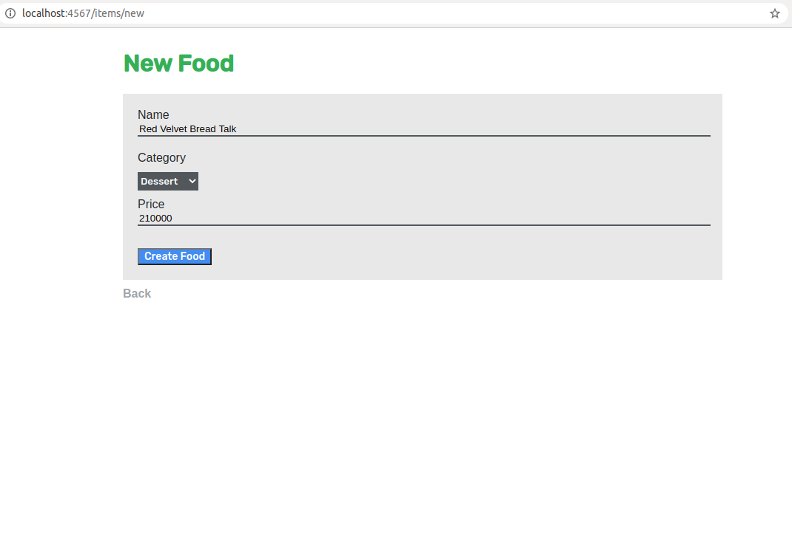
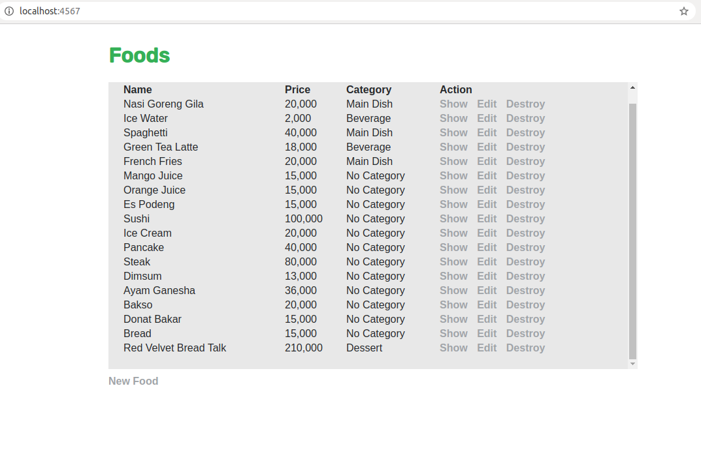
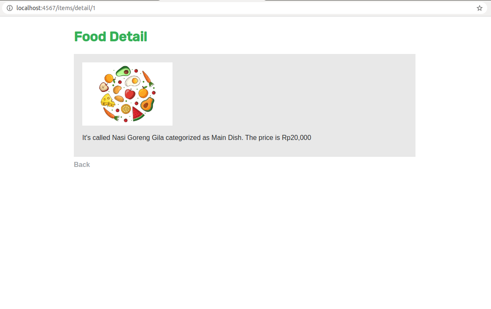
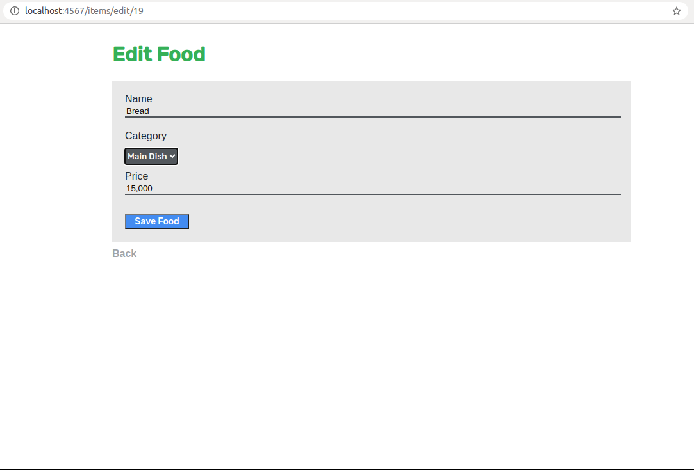
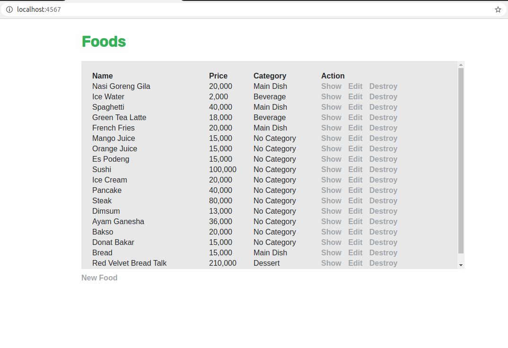

# Week-3 Homework
This folder is used for the homework and exercise in week-3.

## Project Structure
The structure of the project is explained in below. The tag `homework` means the file is the homeworks files.
```
|_ model
| |_ category.rb      (class Category)
| |_ item.rb          (class Item)
|_ public
| |_ img
| |_ stylesheets
| | |_ index.css      (homework - contain styling)
|_ views
| |_ detail_item.erb  (homework - detail functionality)
| |_ edit_item.erb    (homework - edit functionality)
| |_ items.erb
| |_ list_items.erb   (homework - list items functionality)
| |_ login_form.erb
| |_ message.erb
| |_ new_item.erb     (homework - new item functionality)
|_ db_connector.rb    (homework - detail functionality)
|_ db.sql             (homework - database definition)
|_ exercise.rb
|_ index.rb           (homework - index route)
|_ README.md
```

## Instructions
1. Install the needed gems.
```
gem install sinatra
gem install mysql2
gem install mysql2-cs-bind
```
2. Change db username and password in `db_connector.rb`. Login to mysql using the username and password.
3. Copy and paste `db.sql` contents to mysql.
4. Run `ruby index.rb`. To see the web enter `localhost:4567` in your browser.

## Screenshot
### List


### Delete item
After deletion of <b>Cordon Bleu</b>.\


### New item
New food form.\


After addition of <b>Red Velvet Bread Talk</b>.\


### Show item
Show item of <b>Nasi Goreng Gila</b>.\


### Edit item
Edit food form.\


After edit information of <b>Bread</b>\
