# Week-4 Homework
This folder is used for the homework and exercise in week-3.

## Project Structure
The structure of the project is explained in below. The tag `homework` means the file is the homeworks files.
```
|_ controllers
| |_ item_controller.rb
| |_ category_controller.rb
| |_ application_controller.rb
|_ db
| |_ db.sql           
| |_ mysql_connector.rb  
|_ models
| |_ category.rb
| |_ item_category.rb
| |_ item.rb
|_ public
| |_ img
| |_ stylesheets
| | |_ index.css
|_ snapshots      
|_ views
| |_ categories
| | |_ edit.erb  
| | |_ list_items.erb
| | |_ list.erb
| | |_ new.erb    
| |_ items 
| | |_ detail.erb  
| | |_ edit.erb
| | |_ lists.erb
| | |_ new.erb     
|_ main.rb            
|_ README.md
```

## Instructions
1. Install the needed gems.
```
gem install sinatra
gem install mysql2
```
2. Login to mysql using the username and password. Copy and paste `db.sql` contents to mysql.
3. Export the environment variables in terminal. Notes: DB_HOST can use `localhost` value for your personal environment.
```
export DB_HOST=<your_host>          
export DB_NAME=food_oms_db
export DB_USERNAME=<your_username>
export DB_PASSWORD=<your_password>
```
4. Run `ruby main.rb`. To see the web enter `localhost:4567` in your browser.

## Snapshots
Homepage\
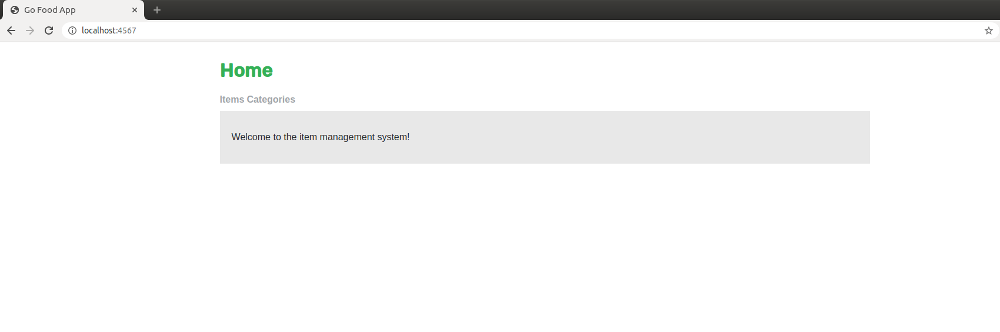

List Items\
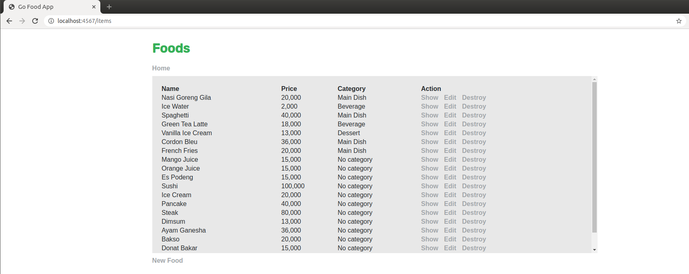

After delete items of <b>Nasi Goreng Gila</b>\
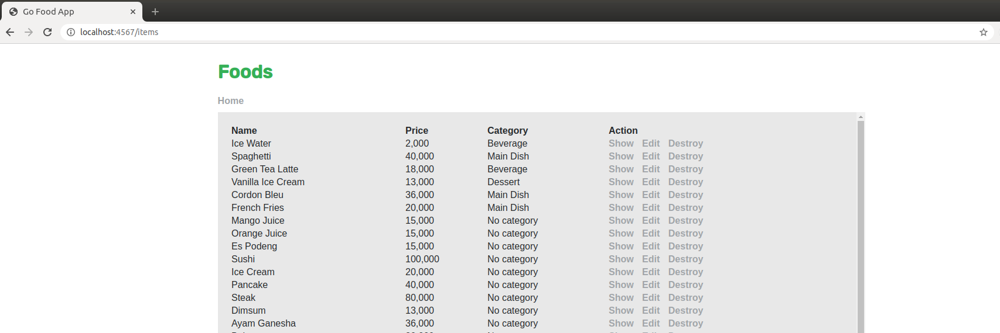

Edit form for item <b>Ice water</b>\


After edit information of <b>Ice Water</b>\
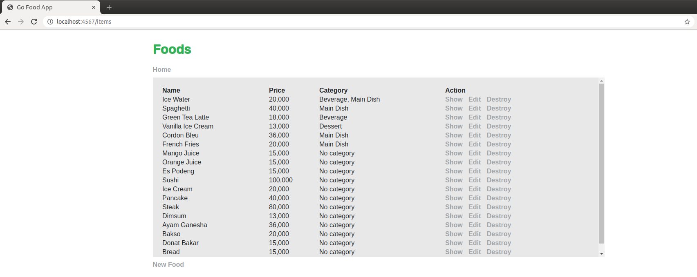

Information details of <b>Ice Water</b>\
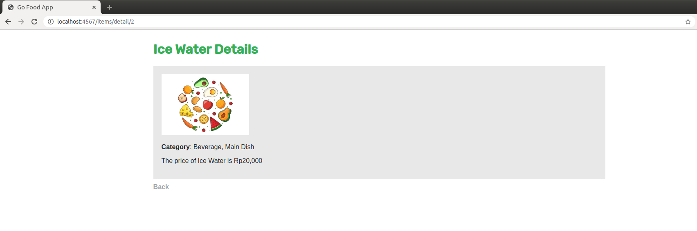

New form of item <b>Ultimate Cheese Pizza</b>\
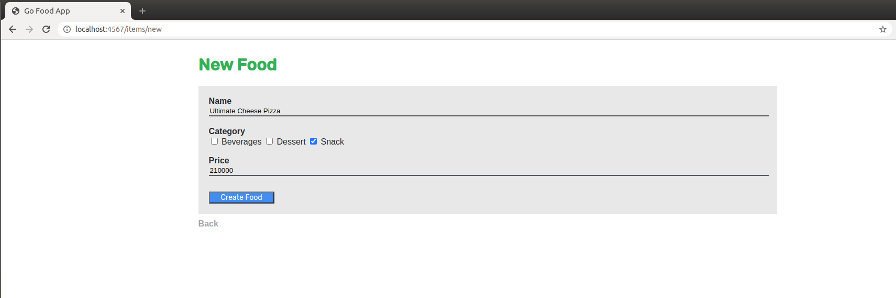

After new information of <b>Ultimate Cheese Pizza</b>\


List categories\
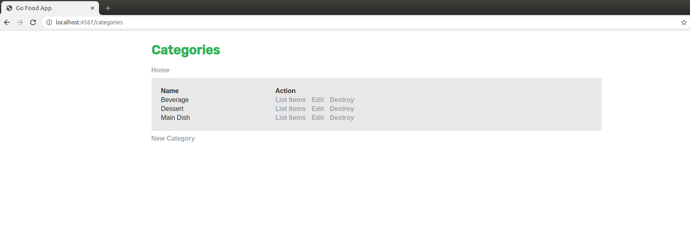

Edit form for category <b>Beverage</b>\
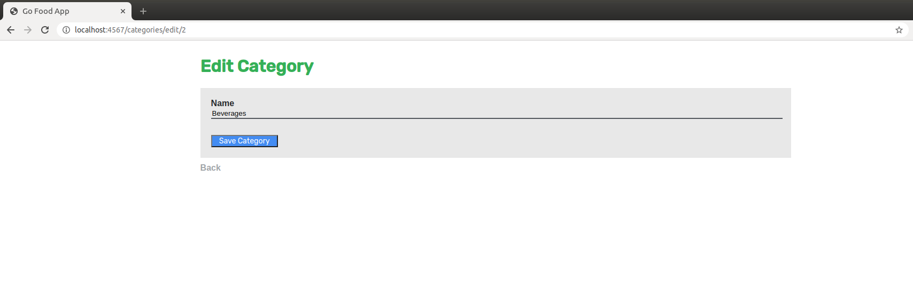

After edit information of category <b>Beverage</b>\
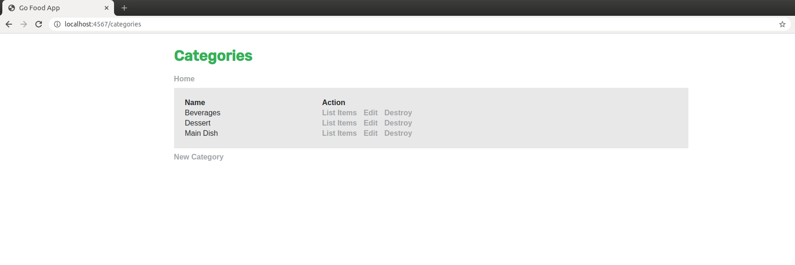

New form of category <b>Snack</b>\
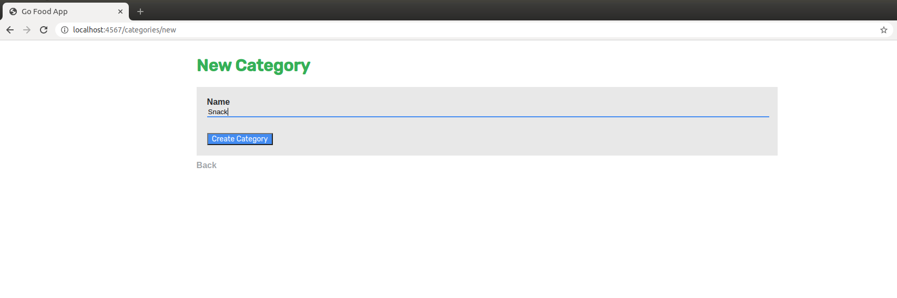

After new information of category <b>Snack</b>\


List items of category <b>Dessert</b>\
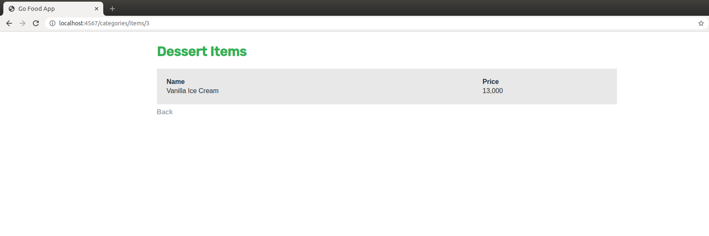

After delete categories of <b>Main Dish</b>\

